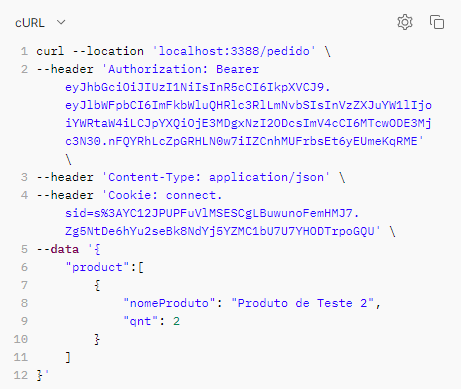

## Nota do Desenvolvedor

* Como maneira de facilitar a leitura e testes das rotas da API com parte da equipe de avaliação, foi criado uma rota responsável por toda a documentação de forma mais visível. Ainda sim, não tira o fato desse documento ter sido criado com as mesmas características.
* Recomendo que, para as instalações e requisitos iniciais, seja feito a letiura desse documento para que não haja problemas, após toda a configuração, você poderá acessar a rota `/api-docs` onde estará visível toda a documentação e rotas da API de forma clara e organizada, tanto como testes, exemplos, retornos de sucessos e possíveis erros.
* Quaisquer dúvidas, entrar em contato com o desenvolvedor responsável para esclarecimentos.

## Requisitos Funcionais

### Produtos:
    [✓] Crie, leia, atualize e delete produtos que podem ser vendidos na cantina.
    [✓] Um produto deve ter pelo menos os seguintes atributos: nome, preço e quantidade em estoque.

### Pedidos:
    [✓] Permita a criação de pedidos, associando produtos a cada pedido.
    [✓] Cada pedido deve ter um status (por exemplo, "em andamento", "concluído", "cancelado")
    [✓] Um pedido pode ter vários produtos e cada produto deve ter uma quantidade associada.

### Autenticação:
    [✓] Implemente autenticação para proteger as rotas de gerenciamento de produtos e pedidos.
    [✓] As operações de CRUD dos produtos e pedidos só devem ser acessíveis por usuários autenticados.

### Relatórios:
    [✓] Crie uma rota para gerar relatórios que mostrem os produtos mais vendidos e a receita total da cantina em um período específico.


## INSTRUÇÕES INICIAIS

Para executar esse código, você terá que possuir alguns requisitos obrigatórios:

> - NodeJS instalado e configurado (Versão Utilizada no Desenvolvimento: v20.9.0)
> - Instalador de pacotes NPM (Versão Utilizada no Desenvolvimento: v10.1.0)
> - Mysql e Workbenck
> - Git

Primeiros passos:

### Utilizando o Código no seu computador

1. Depois da instalação de todas as ferramentas informadas acima, você deverá clonar este repositório.
1. Com o código na sua máquina, você deverá ir para a raiz do projeto e digitar no seu terminal o comando ``` npm install ``` para realizar o download de todos os pacotes que serão necessários a execução do sistema.
1. Após a instalação de todos os módulos, será necessário você configurar as variáveis do código. Crie um arquivo ``` .env ``` e se baseie com o arquivo ``` .env.example ``` que está nesse repositório. Nele, será obrigatório você informar as configurações como a porta do servidor, usuário, senha e nome do banco de dados que você irá utilizar.
```
PORT = YOUR_PORT
SECRET = CHOISE_KEY_SECRET

USER = USER_ROOT_FROM_DATABASE_(DEFAULT: ROOT)
PASS = DATABASE_PASSWORD
```
4. Agora você irá precisar realizar a importação do arquivo de backup do banco de dados para que ele crie todas tabelas que será utilizada nesse sistema, ela encontra-se no diretório: **DESAFIO_API/Database/backup_dbteste.sql**. Todos os valores contidos dentro desse banco são **totalmente fictícios**, por isso que ele está sendo enviado em um repositório público, pois não contém nenhuma informação sensível. O nome do banco de dados por padrão é 'teste', onde já vem configurado no backup gerado.
4. Com o arquivo de configuração corretamente configurado, você poderá executar o comando ``` npx nodemon index.js ``` ou ``` node . ```, esse comando irá ligar o servidor. Uma confirmação que está tudo certo é a seguinte mensagem: "servidor rodando na porta:  (sua porta)".
1. Após isso, se tudo ocorrer bem, o sisitema estará apto para ser testado.

#### **OBS.:** Você deve ter ciência de que todos os valores acima e das ferramentas estão bem configuradas para que o código execute sem nenhum problema!
---
##### A partir daqui, você poderá acessar a rota `localhost:PORT/api-docs`
# Como funciona o sistema?
Todas as rotas da API estão inseridas no arquivo "index.js", como se trata de um sistema simples e para um teste, é válido simplificar todo o tipo de informação e trabalhar com o mínimo de arquivos possíveis.

O jwt do usuário terá como padrão o tempo mínimo de 5 minutos.

Segue as rotas e todas suas interações, as rotas foram testadas via Postman:

` GET /list-produtos `
>*Lista todos os produtos que estão registrados, dentro de um array produtos*
>
>

` POST /login `

>*Realiza login dos usuários, tem como resposta uma mensagem de result e o acess_token onde será necessário para o acesso às outras rotas*
>
>

` POST /adiciona-produto `

>*Realiza a inserção dos produtos, onde será necessário repassar algumas informações, como:*
>
>- Nome do Produto
>- Preço
>- Quantidade de Estoque 
>
> Assim como será necessário também repassar o **access_token** no header da requisição como `Authorization Bearer`
>
>

` PUT /atualiza-produto?nomeProduto=[nome_do_produto] `

>*Realiza a atualização das informações contidas no produto, onde terá que ser repassado o nome do produto que deseja atualizar como query da rota.<br> No corpo da requisição, as variáveis que deverão ser passadas são todas as informações novas que você deseja alterar do produto informado.*
>
>- new_nomeProduto = novo nome do produto
>- new_preco = novo preço do produto
>- new_qntEstoq = novo número de estoque
>
>***OBS.: Para que as informações sejam alteradas corretamente, no body da requisição você deverá informar todos as variáveis. Se você não desejar alterá-la, repita o mesmo nome que ela já possui.***<br>
>
>Você precisará ter no header da requisição o **access_token** para realizar a consulta.
>
>
>
>Como mensagem de sucesso, a API retornará:<br>`"msg": "Produto atualizado com sucesso!"`

` DELETE /remove-produto `
>*Realiza a remoção do produto inserido.<br>No corpo da requisição, você deverá informar o nome do produto que será deletado. Você também deverá informar o **access_token** para realizar essa operação*
>
>
>
>Como mensagem de sucesso, a API retornará:<br>`"msg": "Produto Deletado."`

` POST /pedido `
>*Essa rota realizará a solicitação de um pedido do produto, será registrado um número de pedido e os produtos que foram solicitados serão vinculados nesse número de pedido. Todos os pedidos criados iniciarão com o status 'Em Andamento'*
>
>*No corpo da requisição, você deverá repassar duas informações:*<br>
>* nomeProduto: Nome do Produto para pedido
>* qnt: Quantidade do produto para pedido
>
>
>
>Como mensagem de sucesso, a API retornará:<br>
>```
>"msg": "Pedido realizado com sucesso",
>"num_pedido": "#45814022680787274435"
>```
>>

`GET /list-pedidos`

>*Rota que retorna a lista de pedidos registrados, retornando número do pedido, status desse pedido e todos os produtos que estão vinculados dentro desse número de pedido, tal como sua quantidade e nome do produto em específico.*
>
>
>
>Como mensagem de sucesso, a API retornará:<br>
>```
>"msg": "Sucesso",
>"product": [{
>       "n_pedidos": número do pedido,
>       "status_pedido": status do pedido,
>       "produtos": [
>               {
>                   "qnt": quantidade solicitada,
>                   "nome_produto": nome do produto solicitado
>               }
>           ] 
>}]
>```